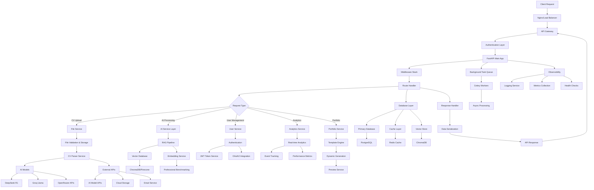

# PORTMAN Backend Architecture 2025
**Status**: ✅ **GITHUB VERSION RESTORED & CLEANED**  
**Last Updated**: June 9, 2025

## 📊 Implementation Status Overview

### ✅ COMPLETED (100%)
- **Core FastAPI Application** - Traditional FastAPI with routers and middleware
- **Authentication System** - JWT tokens, user registration/login, secure password hashing
- **Database Models** - SQLAlchemy with SQLite (production-ready for PostgreSQL)
- **API Endpoints** - Complete CV upload/parsing, user management, portfolio generation
- **CV Processing** - AI-powered parsing with DeepSeek R1 and Groq integration
- **ATS Resume Generation** - 4 professional templates with keyword optimization
- **Analytics System** - Real-time metrics, user engagement tracking
- **Portfolio Generation** - Multiple templates with customization options
- **RAG Pipeline** - Professional comparison and benchmarking system
- **Health Monitoring** - Comprehensive health checks and logging

### 🚧 IMPROVEMENTS NEEDED (Modern Architecture Migration)
- **Modern FastAPI Structure** - Migrate to app factory pattern with proper dependency injection
- **Async Database Operations** - Convert to async SQLAlchemy 2.0+ with connection pooling
- **Pydantic V2 Models** - Upgrade validation schemas to Pydantic V2 with enhanced performance
- **Advanced Security** - Rate limiting, CSRF protection, enhanced middleware stack
- **Container Architecture** - Docker multi-stage builds and production optimization
- **Monitoring Integration** - Prometheus metrics, Sentry error tracking
- **Vector Database** - ChromaDB integration for semantic search capabilities
- **Background Task Queue** - Celery/Redis for heavy AI processing

## 🏗️ System Architecture Flowchart



## 🚀 Modern Technology Stack

### Core Framework
- **FastAPI 0.115+** - Latest with new CLI, enhanced performance
- **Pydantic V2** - Data validation with 5-20x performance boost
- **Starlette** - ASGI foundation with WebSocket support
- **Uvicorn[standard]** - ASGI server with uvloop for maximum performance

### Database & Storage
- **PostgreSQL 16** - Primary relational database with JSONB support
- **Redis 7** - Caching, sessions, and message broker
- **ChromaDB** - Vector database for AI embeddings
- **MinIO/S3** - Object storage for files and media

### AI & ML Services
- **Instructor** - Structured LLM outputs with Pydantic
- **LangChain/LangGraph** - AI workflow orchestration
- **Sentence Transformers** - Local embedding generation
- **OpenAI/Anthropic APIs** - Production AI models
- **Vector Search** - Semantic similarity and RAG

### Authentication & Security
- **FastAPI-Users** - Complete auth solution
- **Passlib[bcrypt]** - Password hashing
- **python-jose[cryptography]** - JWT handling
- **OAuth2/OIDC** - Social login integration

### Async & Background Processing
- **Celery** - Distributed task queue
- **Redis** - Message broker
- **AsyncIO** - Native async support
- **Background Tasks** - FastAPI built-in tasks

### Monitoring & Observability
- **Prometheus** - Metrics collection
- **Grafana** - Visualization dashboards
- **Sentry** - Error tracking and performance
- **Structlog** - Structured logging
- **OpenTelemetry** - Distributed tracing

### API & Documentation
- **OpenAPI 3.1** - API specification
- **Swagger UI** - Interactive documentation
- **ReDoc** - Alternative documentation
- **API Versioning** - Backward compatibility

### Development & DevOps
- **Poetry** - Dependency management
- **Pre-commit** - Code quality hooks
- **Black/Ruff** - Code formatting and linting
- **Pytest** - Testing framework
- **Docker** - Containerization
- **GitHub Actions** - CI/CD pipeline

## 📊 Key Features & Capabilities

### 1. High Performance
- Async/await throughout
- Connection pooling
- Response caching
- Database query optimization
- Background task processing

### 2. Scalability
- Microservice-ready architecture
- Horizontal scaling support
- Load balancing
- Database sharding capability
- CDN integration

### 3. Security
- JWT authentication
- CORS configuration
- Rate limiting
- Input validation
- SQL injection prevention
- XSS protection

### 4. Developer Experience
- Type hints everywhere
- Auto-generated documentation
- Hot reload in development
- Comprehensive error handling
- IDE integration

### 5. AI-First Design
- Vector similarity search
- Real-time AI processing
- Model versioning
- Fallback strategies
- Cost optimization

## 🔄 Data Flow

1. **Request Ingestion** → Authentication → Validation
2. **Business Logic** → Service Layer → Database Operations
3. **AI Processing** → Model Inference → Result Caching
4. **Response Generation** → Serialization → Client Delivery
5. **Background Tasks** → Async Processing → Notifications

## 🛡️ Security Layers

1. **Network Security** - HTTPS, CORS, Rate Limiting
2. **Authentication** - JWT, OAuth2, MFA support
3. **Authorization** - RBAC, Resource-based permissions
4. **Data Protection** - Encryption at rest and in transit
5. **Input Validation** - Pydantic models, SQL injection prevention

## 📈 Performance Optimizations

1. **Database** - Connection pooling, query optimization, indexing
2. **Caching** - Redis for sessions, API responses, computed results
3. **Async Operations** - Non-blocking I/O throughout
4. **Background Processing** - Celery for heavy computations
5. **CDN** - Static asset delivery optimization

## 🔍 Monitoring Strategy

1. **Application Metrics** - Response times, error rates, throughput
2. **Infrastructure Metrics** - CPU, memory, disk, network
3. **Business Metrics** - User engagement, feature usage
4. **AI Model Metrics** - Accuracy, latency, cost tracking
5. **Security Metrics** - Failed auth attempts, suspicious activity

## 🏗️ Current vs Modern Architecture Comparison

### ✅ CURRENT GITHUB IMPLEMENTATION (Traditional FastAPI)

#### **File Structure (Working)**
```
backend/
├── main.py                  # FastAPI app with routers
├── cv.py                   # CV upload/parsing endpoints  
├── users.py                # User auth endpoints
├── portfolio.py            # Portfolio generation
├── ats_resume.py          # ATS resume templates
├── analytics.py           # Analytics dashboard
├── advanced_rag.py        # RAG pipeline
├── logs.py                # Logging system
├── auth_utils.py          # JWT utilities
├── professional_analysis.py # AI analysis
├── requirements.txt       # Dependencies
└── uploaded_cvs/          # File storage
```

#### **Features Implemented**
- ✅ **CV Upload & Parsing** - File upload with AI-powered extraction
- ✅ **User Authentication** - JWT-based auth with registration/login
- ✅ **Portfolio Generation** - 4 templates with customization
- ✅ **ATS Resume Builder** - Professional templates with optimization
- ✅ **Analytics Dashboard** - Metrics tracking and reporting
- ✅ **RAG Pipeline** - Professional comparison and benchmarking
- ✅ **AI Integration** - DeepSeek R1, Groq, OpenRouter APIs
- ✅ **Health Monitoring** - Health checks and logging
- ✅ **CORS & Middleware** - Production-ready configuration

#### **API Endpoints (All Working)**
```
GET  /healthz                    # System health
GET  /docs                      # API documentation

# Authentication & Users
POST /api/v1/users/register     # User registration
POST /api/v1/users/login        # User login
GET  /api/v1/users/me           # Current user profile

# CV Processing
POST /api/v1/cv/upload          # CV file upload
POST /api/v1/cv/parse           # AI-powered parsing

# Portfolio Generation
GET  /api/v1/portfolio/templates # Available templates
POST /api/v1/portfolio/generate  # Generate portfolio

# ATS Resume Builder  
GET  /api/v1/ats/templates      # ATS templates
POST /api/v1/ats/generate       # Generate ATS resume

# Analytics & RAG
GET  /api/v1/analytics/dashboard # Analytics data
POST /api/v1/cv/rag/analyze     # RAG-based analysis

# Logging
GET  /logs                      # Retrieve logs
POST /logs                      # Submit logs
```

### 🚧 MODERN ARCHITECTURE GOALS (Future Enhancement)

#### **Proposed Modern Structure**
```
backend/
├── app/
│   ├── __init__.py
│   ├── main.py              # App factory pattern
│   ├── core/
│   │   ├── config.py        # Pydantic settings
│   │   ├── database.py      # Async SQLAlchemy 2.0+
│   │   ├── security.py      # Enhanced security
│   │   └── logging.py       # Structured logging
│   ├── models/              # SQLAlchemy models
│   ├── schemas/             # Pydantic V2 schemas
│   ├── api/v1/              # Versioned API routes
│   ├── services/            # Business logic layer
│   ├── crud/                # Database operations
│   └── utils/               # Utilities
├── tests/                   # Comprehensive testing
├── alembic/                 # Database migrations
├── docker/                  # Container configuration
├── pyproject.toml          # Poetry configuration
└── requirements/           # Environment-specific deps
```

#### **Modern Enhancements Needed**
- 🔧 **App Factory Pattern** - Proper dependency injection
- 🔧 **Async Database** - SQLAlchemy 2.0+ with async support
- 🔧 **Pydantic V2** - Enhanced validation and performance
- 🔧 **Rate Limiting** - API protection and throttling
- 🔧 **Background Tasks** - Celery for heavy processing
- 🔧 **Vector Database** - ChromaDB integration
- 🔧 **Monitoring** - Prometheus, Grafana, Sentry
- 🔧 **Testing** - Comprehensive test suite
- 🔧 **Docker** - Multi-stage production builds
- 🔧 **Security** - Enhanced middleware stack

## 🎯 Migration Strategy

### Phase 1: Core Architecture (Priority)
1. **Database Migration** - Convert to async PostgreSQL
2. **App Factory** - Implement proper dependency injection  
3. **Pydantic V2** - Upgrade validation schemas
4. **Testing Suite** - Add comprehensive tests

### Phase 2: Production Features
1. **Background Tasks** - Implement Celery/Redis
2. **Vector Database** - Add ChromaDB integration
3. **Monitoring** - Prometheus metrics
4. **Container** - Docker production setup

### Phase 3: Advanced Features  
1. **Rate Limiting** - API protection
2. **Caching** - Redis response caching
3. **Security** - Enhanced middleware
4. **Observability** - Distributed tracing
