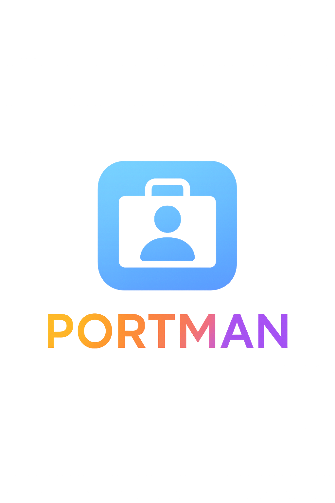

# 🎯 PORTMAN - AI-Powered CV Analysis & Portfolio Generator

[](https://opensource.org/licenses/MIT)
[](https://nextjs.org/)
[](https://fastapi.tiangolo.com/)
[](https://netlify.com)



> **Transform your CV into professional insights with AI-powered analysis and automated portfolio generation**

## 🌟 Features

- **AI-Powered CV Analysis**: Advanced parsing and optimization using modern AI models
- **Portfolio Generation**: Automatic creation of professional portfolio websites
- **ATS Optimization**: Resume optimization for Applicant Tracking Systems
- **Modern Dashboard**: Compact, responsive interface with real-time status monitoring
- **Document Processing**: Support for multiple file formats (PDF, DOCX, TXT)
- **User Authentication**: Secure login system with profile management
- **Auto Deployment**: Automatic deployment to Vercel on GitHub push
- **Real-time Status**: Live system health monitoring and processing queues

## 🛠️ Technology Stack

### Frontend
- **Next.js 14** - React framework with App Router
- **TypeScript** - Type-safe development
- **Tailwind CSS** - Modern styling with custom components
- **Framer Motion** - Smooth animations and transitions
- **Lucide React** - Beautiful icons
- **Vercel** - Production deployment platform

### Backend
- **FastAPI** - High-performance Python web framework
- **SQLAlchemy** - Database ORM with SQLite
- **Pydantic** - Data validation and serialization
- **Python-JOSE** - JWT token handling
- **Uvicorn** - ASGI server

### AI Services
- **Custom AI Integration** - Advanced document processing
- **Vector RAG** - Retrieval-Augmented Generation
- **CV Analysis Engine** - Intelligent content extraction

## 🚦 Quick Start

### Prerequisites
- **Node.js** (v18 or higher)
- **Python** (v3.8 or higher)
- **npm** or **yarn**

### 1. Clone the Repository
```bash
git clone https://github.com/yourusername/portman.git
cd portman
```

### 2. Setup Backend
```bash
cd backend
pip install -r requirements.txt
python init_database.py
```

### 3. Setup Frontend
```bash
cd frontend
npm install
```

### 4. Start Development Servers
Simply run the batch file:
```bash
start_portman_dev.bat
```

Or start manually:
```bash
# Terminal 1 - Backend
cd backend
python -m uvicorn main:app --reload --host 0.0.0.0 --port 8000

# Terminal 2 - Frontend
cd frontend
npm run dev
```

## 🌐 Access Points

- **Frontend Application**: http://localhost:3000
- **Backend API**: http://localhost:8000
- **API Documentation**: http://localhost:8000/docs
- **Interactive API**: http://localhost:8000/redoc

## 📱 Dashboard Features

The PORTMAN dashboard includes:

- **Real-time Stats**: Document processing metrics and system status
- **File Management**: Upload, process, and manage documents
- **Activity Monitoring**: Live processing activities and queue status
- **Quick Actions**: One-click access to common tasks
- **Responsive Design**: Optimized for all screen sizes
- **Modern UI**: Clean, professional interface with smooth animations

## 🔒 Authentication

- **User Registration/Login**: Secure account management
- **Admin Panel**: Administrative controls and user management
- **JWT Tokens**: Secure API authentication
- **Protected Routes**: Role-based access control

## 📊 System Status

The application includes comprehensive system monitoring:
- Success rates and processing metrics
- Queue length and storage usage
- Real-time activity feeds
- Health checks and error tracking

## 🗂️ Project Structure

```
PORTMAN/
├── frontend/          # Next.js React application
├── backend/           # FastAPI Python server
├── ai_services/       # AI processing modules
├── database/          # Database files and migrations
├── docs/              # Documentation
├── scripts/           # Utility scripts
├── tests/             # Test files
├── archive/           # Archived documentation
└── templates/         # Email and document templates
```

## 🧪 Testing

Run the test suite:
```bash
# Backend tests
cd backend
python -m pytest

# Frontend tests
cd frontend
npm test
```

## 🚢 Deployment

### Production Build
```bash
# Frontend
cd frontend
npm run build

# Backend
cd backend
pip install -r requirements.txt
python -m uvicorn main:app --host 0.0.0.0 --port 8000
```

### Docker (Optional)
```bash
docker-compose -f docker-compose.production.yml up -d
```

## 🤝 Contributing

1. Fork the repository
2. Create a feature branch (`git checkout -b feature/amazing-feature`)
3. Commit your changes (`git commit -m 'Add amazing feature'`)
4. Push to the branch (`git push origin feature/amazing-feature`)
5. Open a Pull Request

## 📝 License

This project is licensed under the MIT License - see the [LICENSE](LICENSE) file for details.

## 🎯 Roadmap

- [ ] Enhanced AI models integration
- [ ] Multi-language support
- [ ] Advanced portfolio themes
- [ ] Export to multiple formats
- [ ] Integration with job platforms
- [ ] Mobile application

## 📧 Contact

For questions and support, please open an issue on GitHub.

---

**PORTMAN** - Transforming careers through intelligent document processing.
